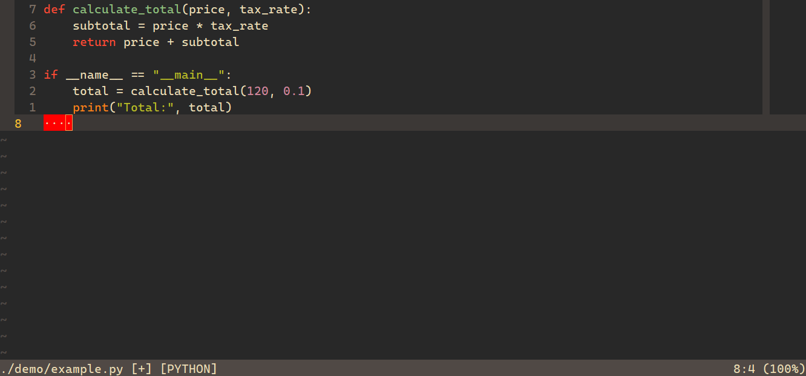

<p align="center">

</p>

# Corporate-Safe Vim Configuration


A **pure Vim configuration designed for restricted corporate environments**.

No plugins.
No external tools.
No Python / Node / ripgrep / ctags calls.

Just **stock Vim features used effectively**.

---

# Features

• Plugin-free
• Self-contained `.vimrc`
• Works on stock Vim installations
• Gruvbox → Desert theme fallback
• Project-wide search using Vim built-ins
• VSCode-style sidebar file explorer
• Clean navigation shortcuts
• Automatic whitespace cleanup
• Safe backup and undo handling

Supported languages:

```
SQL
CSS
JavaScript
Python
JSON
Markdown
PHP
YAML
TOML
INI
Lua
C / C++
Java
Object Pascal
```

# Screenshot

Example editing experience using this configuration.

<p align="center">

</p>

Editing Python with:

- relative line numbers
- cursor line highlight
- whitespace markers
- color column at 100
- Gruvbox theme


---

# Installation

Linux / macOS

```
~/.vimrc
```

Windows

```
%USERPROFILE%\_vimrc
```

Restart Vim after installing.

---

# Theme Behavior

The configuration prefers **Gruvbox** if available.

```
colorscheme gruvbox
```

If Gruvbox is unavailable, Vim falls back to:

```
colorscheme desert
```

---

# Sidebar File Explorer

Open the sidebar file explorer:

```
Space e
```

This uses Vim’s built-in **netrw** in sidebar mode (`Lexplore`).

Features:

• left sidebar
• tree view
• quick file navigation
• no plugins required

---

# Navigation

Leader key:

```
Space
```

---

### Files

| Action           | Shortcut      |
| ---------------- | ------------- |
| Open file        | `Space f`     |
| Sidebar explorer | `Space e`     |
| Switch last file | `Space Space` |

---

### Project Search

| Action          | Shortcut  |
| --------------- | --------- |
| Search project  | `Space g` |
| Next result     | `]q`      |
| Previous result | `[q`      |

Example:

```
:vimgrep /TODO/ **/*.py
```

---

### Buffers

| Action          | Shortcut   |
| --------------- | ---------- |
| Next buffer     | `Space bn` |
| Previous buffer | `Space bp` |
| Close buffer    | `Space bd` |

---

### Windows

| Action     | Shortcut |
| ---------- | -------- |
| Move left  | `Ctrl h` |
| Move down  | `Ctrl j` |
| Move up    | `Ctrl k` |
| Move right | `Ctrl l` |

Resize windows:

```
Space ← → ↑ ↓
```

---

### Save / Quit

| Action      | Shortcut  |
| ----------- | --------- |
| Save        | `Space w` |
| Quit        | `Space q` |
| Save & quit | `Space x` |

---

# Editing Quality of Life

Clear search highlight

```
Space /
```

Toggle paste mode

```
F2
```

Trailing whitespace is automatically removed on save.

---

# Philosophy

This configuration focuses on three principles:

**Reliability**

Works everywhere Vim runs.

**Compliance**

Safe for environments that forbid plugins or external tools.

**Speed**

Navigation should be faster than thinking.

---

# License

MIT License
