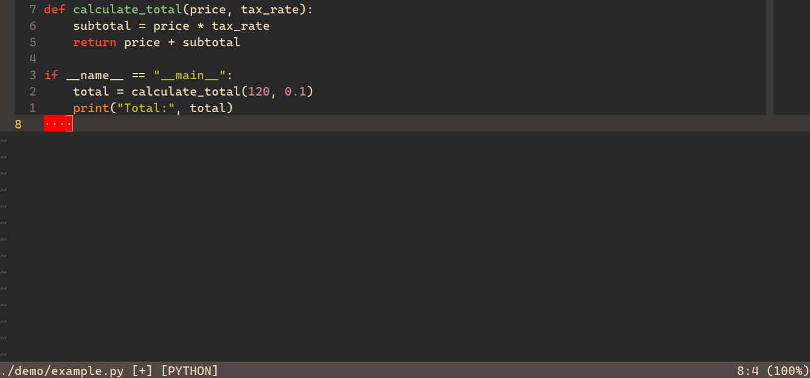

# Corporate-Safe Vim Configuration

<p align="center">

</p>


**Plugin-Free Vim for Locked-Down Workstations**

A **pure Vim configuration designed for restricted corporate environments**.

No additional Vim plugins. No package managers. No Python / Node / ripgrep / ctags calls. No external binaries required.

Just **stock Vim features used effectively**.

---

## What Corporate-Safe Means Here

In this repository, **corporate-safe** means the configuration is designed to run on stock Vim without extra Vim plugins or command-line dependencies that usually need approval on locked-down workstations.

It does **not** claim formal security certification, company policy approval, or a zero local data footprint. Vim still creates local backup, undo, swap, and session files for recovery and workflow continuity; those files are documented below.

---

## Features

- [x] Plugin-free
- [x] Self-contained `.vimrc`
- [x] Works on stock Vim (Linux, macOS, Windows)
- [x] Truecolor support
- [x] Gruvbox fallback to Desert
- [x] Sidebar file explorer
- [x] Prompted project search using `vimgrep`
- [x] Search word under cursor across the project
- [x] In-editor shortcut cheatsheet
- [x] Recent-file and buffer pickers
- [x] Whitespace visibility (tabs, trailing spaces, nbsp)
- [x] Language-aware indentation (consistent tabstop/shiftwidth/softtabstop per filetype)
- [x] Count-aware `j`/`k` motion (works with `5j`, `10k`, etc.)
- [x] Hidden buffers for easier switching between unsaved files
- [x] Smarter built-in completion and command-line matching
- [x] Centralized swap files for crash recovery
- [x] Auto-reload files changed outside Vim
- [x] Per-project auto-save and restore sessions (terminal buffers excluded)

Supported languages:

- SQL
- CSS
- JavaScript
- Python
- JSON
- Markdown
- PHP
- YAML
- TOML
- INI
- Lua
- C / C++
- Java
- Object Pascal

## Screenshot

Example editing experience using this configuration.



Editing Python with:

- relative line numbers
- cursor line highlight
- whitespace markers
- color column at 100
- Gruvbox theme

---

## Installation

### Linux / macOS

```text
~/.vimrc
```

### Windows

```text
%USERPROFILE%\_vimrc
```

On Windows, Vim also creates its runtime directories under `~/vimfiles/` (backup, undo, swap, per-project sessions) automatically.

Restart Vim after installing.

---

## Runtime Files and Recovery

This configuration does not require plugins or external tools, but Vim still creates local recovery and history files. They are kept in central folders instead of being scattered through project directories.

| File type | Linux / macOS | Windows | Purpose |
| --------- | ------------- | ------- | ------- |
| Backups   | `~/.vim/backup/` | `~/vimfiles/backup/` | Last saved file copies |
| Undo      | `~/.vim/undo/` | `~/vimfiles/undo/` | Persistent undo history |
| Swap      | `~/.vim/swap/` | `~/vimfiles/swap/` | Crash recovery for unsaved edits |
| Sessions  | `~/.vim/sessions/` | `~/vimfiles/sessions/` | Per-project window and buffer layout |

These files can contain source text. Treat those directories as part of your normal development footprint and clear them according to your company's retention rules.

---

## Quick Install

### Linux / macOS (curl)

```bash
curl -fsSL https://raw.githubusercontent.com/ikelaiah/vimrc/main/.vimrc -o ~/.vimrc
```

### Windows (PowerShell)

```powershell
Invoke-WebRequest https://raw.githubusercontent.com/ikelaiah/vimrc/main/.vimrc -OutFile $HOME\_vimrc
```

---

## Theme Behavior

The configuration prefers **Gruvbox** if available.

```vim
colorscheme gruvbox
```

If Gruvbox is unavailable, Vim falls back to:

```vim
colorscheme desert
```

---

## Sidebar File Explorer

Open the sidebar file explorer:

```text
Space e
```

This uses Vim's built-in **netrw** in sidebar mode (`Lexplore`).

Features:

- left sidebar
- tree view
- quick file navigation
- opens at the original project directory from `vim .`
- no plugins required

---

## Navigation

Leader key: `Space`

Open the in-editor shortcut cheatsheet:

```text
Space ?
```

---

### Files

| Action           | Shortcut      |
| ---------------- | ------------- |
| Open file        | `Space ff`    |
| Open recent file | `Space fr`    |
| Sidebar explorer | `Space e`     |
| Switch last file | `Space Space` |

---

### Project Search

| Action                   | Shortcut   |
| ------------------------ | ---------- |
| Search project           | `Space g`  |
| Search project alias     | `Space fg` |
| Search word under cursor | `Space fw` |
| Next result              | `]q`       |
| Previous result          | `[q`       |
| Open results             | `Space co` |
| Close results            | `Space cc` |

Example:

```vim
:vimgrep /TODO/ **/*.py
```

`Space g` and `Space fg` prompt for the search term, run `vimgrep`, and open the quickfix list automatically.

---

### Buffers

| Action          | Shortcut   |
| --------------- | ---------- |
| Choose buffer   | `Space fb` |
| Next buffer     | `Space bn` |
| Previous buffer | `Space bp` |
| Close buffer    | `Space bd` |

---

### Windows

| Action                  | Shortcut       |
| ----------------------- | -------------- |
| Move left               | `Ctrl h`       |
| Move down               | `Ctrl j`       |
| Move up                 | `Ctrl k`       |
| Move right              | `Ctrl l`       |
| Cycle to next window    | `Ctrl w w`     |
| Split horizontally      | `Space -`      |
| Split vertically        | `Space \`      |
| Equalise all windows    | `Space =`      |
| Close current split     | `Space c`      |
| Keep only current split | `Space o`      |

Resize windows:

```text
Space ← → ↑ ↓
```

---

### Save / Quit

| Action                        | Shortcut  |
| ----------------------------- | --------- |
| Save                          | `Space w` |
| Quit (prompts if unsaved)     | `Space q` |
| Save & quit                   | `Space x` |
| Force quit (discard changes)  | `Space Q` |

---

## Sessions

Sessions save and restore your open buffers, window layout, tabs, and folds on a per-project basis. Each working directory gets its own session file, so `vim .` inside different folders restores different layouts.

| Action          | Shortcut   |
| --------------- | ---------- |
| Save session    | `Space ss` |
| Restore session | `Space sr` |
| Delete session  | `Space sd` |

**Auto-save / auto-restore:** When Vim is opened with no file arguments, or with a single directory argument such as `vim .`, Vim restores the session for that directory on startup and saves back to that same directory-specific session on exit.

**Terminal safety:** Auto-save wipes terminal buffers before the session file is written, so a broken `:terminal` can never poison the saved project session. Manual `Space ss` refuses to save while terminal buffers are open; quit Vim normally instead and the auto-save path will strip them safely.

**Safe restore:** The following buffer types are automatically discarded on restore:

- Terminal buffers (`term://`) — stuck terminals can never block startup
- netrw explorer buffers — avoids broken internal tree state errors
- Quickfix / location list windows
- Scratch buffers (help, man pages, previews)
- Files that no longer exist on disk

---

## Exiting Vim

The recommended ways to exit, from most to least cautious:

| Situation                     | Command    | What it does                         |
| ----------------------------- | ---------- | ------------------------------------ |
| Save and quit current window  | `Space x`  | Writes only if changed, then quits   |
| Save and quit current window  | `:x`       | Same as above (built-in command)     |
| Save and quit                 | `:wq`      | Always writes, then quits            |
| Quit with prompt if unsaved   | `Space q`  | Prompts Save/Discard/Cancel          |
| Quit (no unsaved changes)     | `:q`       | Quits if buffer is clean             |
| Force quit, discard changes   | `Space Q`  | Discards all changes, no prompt      |
| Force quit                    | `:q!`      | Discards unsaved changes, then quits |
| Quit all windows              | `:qa`      | Quits all windows (fails if unsaved) |
| Quit all, discard all changes | `:qa!`     | Force-quits everything               |
| Save all and quit all         | `:wqa`     | Saves all buffers, quits all windows |

> **Tip:** If you are stuck in insert mode, press `Esc` first, then use any of the above.
>
> **Tip:** If you opened a terminal inside Vim (`:terminal`) and it is unresponsive, close it with `:bwipeout!` or quit all with `:qa!`.

---

## Editing Quality of Life

Open shortcut help:

```text
Space ?
```

Clear search highlight:

```text
Space /
```

Toggle paste mode:

```text
F2
```

Toggle wrap:

```text
Space z
```

Toggle whitespace markers:

```text
Space l
```

Trailing whitespace is visually highlighted but not automatically removed on save.

---

## Philosophy

This configuration focuses on three principles:

### Reliability

Works everywhere Vim runs.

### Low Approval Footprint

Usable in environments that forbid editor plugins, package managers, or external helper tools.

### Speed

Navigation should be faster than thinking.

---

## Why This Exists

Many corporate environments restrict developers from installing or approving:

- editor plugins
- package-managed dependencies
- external binaries
- scripting runtimes

This repository demonstrates that Vim can still provide a productive
editing experience using only built-in functionality.

---

## License

MIT License
